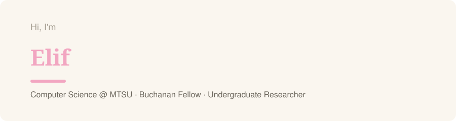

<!-- Replace YOUR_USERNAME and the TODO links. All visuals are local SVGs in /assets, no third-party services. -->

  

  <b>ML + systems + full-stack.</b> Researching brain-imaging ML, building tools that predict where code breaks. 
  Looking for software engineering internships and new-grad roles.

  <a href="https://linkedin.com/in/TODO">LinkedIn</a> &nbsp;·&nbsp;
  <a href="mailto:TODO@email.com">Email</a> &nbsp;·&nbsp;
  <a href="TODO-resume-link">Resume</a>

## Featured work

  
  
  
  

## Stack

  

## Timeline

  

